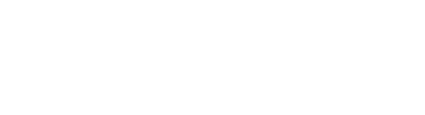
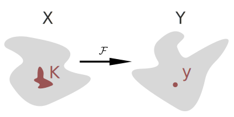
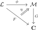
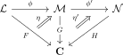
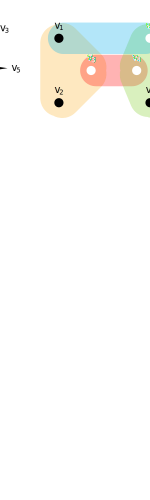
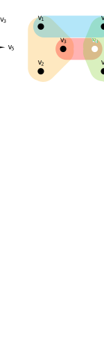
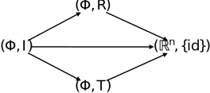
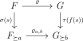
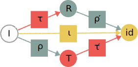
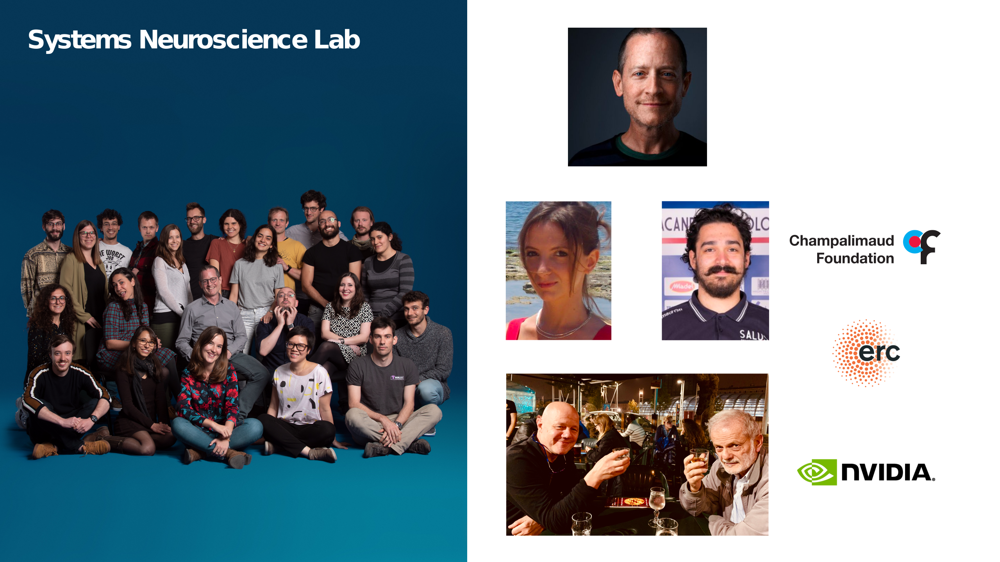

class: center, middle
background-image: url(assets/champalimaud.jpg)

<h1 class="almost_white">RetNets: a new framework for artificial intelligence</h1>
<h2 class="almost_white">Pietro Vertechi, Mattia G. Bergomi</h2>
<h3 class="almost_white">Champalimaud Research</h3>

---

## Outline

- Foundations:

    * Banach algebras and closed ideals,

    * complete lattices and Galois connections.

--

- The framework of *reticular functions*:

    * composability,

    * locality,

    * layered architecture,

    * partial equivariance.

--

- Applications:

    * recover classical neural network architectures with power set lattice,

    * multi-layer partially equivariant image classification.

---

## Motivating example: bounded operators

Let $A, B$ be two Banach algebras, and $\mathcal{I}, \mathcal{J}$ their complete lattices of closed ideals. 
Let $\mathcal{F}\colon A\rightarrow B$ be a bounded linear operator (not necessarily algebra homomorphism).

--

This induces maps

\[
\begin{aligned}
\phi \colon \mathcal{I} &\rightarrow \mathcal{J} \quad & \quad \psi \colon \mathcal{J} &\rightarrow \mathcal{I} \\
I &\mapsto \overline{\mathrm{span}}(\mathcal{F}(I)) \quad & \quad J &\mapsto \max\{I \in \mathcal{I} \; | \; \mathcal{F}(I) \subseteq J\}
\end{aligned}
\]

which define a Galois connection $\mathcal{I}\leftrightarrows \mathcal{J}$:

$$
\phi(I) \subseteq J
\quad\text{ if and only if }\quad
I \subseteq \psi(J).
$$

--

$\mathcal F$ induces a family of compatible operators $$A/I \rightarrow B/\phi(I).$$

---

## Galois connection describes locality

<b>Locality.</b> Let $A,B$ be Banach algebras of functions over some topological spaces $X,Y$.  Let $J = \{ f\in B \; | \; f(y) = 0\}$ for some point $y\in Y$, and $\psi(J) = \{ f\in A \; | \; f(K) = 0\}$. The value of $\mathcal{F}(f)(y)$ only depends on $f{\restriction_K}$.

--

</img>

**Example.** In the case of a convolutional layer, $K$ is the support of the filter (shifted).

---

## The reticular framework

<b>Def.</b> Given a category $\mathbf C$, a <i>$\mathbf C$-reticulum</i> is a complete lattice $\mathcal L$ together with a functor $F\colon\mathcal L \rightarrow\mathbf C$.

In practice, $F$ consists of a family of objects $F(l)$ for $l\in\mathcal L$, and a family of maps $$F(l\_1\preceq l\_2)\colon F(l\_1)\rightarrow F(l\_2)$$ for $l\_1\preceq l\_2\in\mathcal L$, such that:

- $F(l\preceq l)$ is the identity,

- $F(l\_2 \preceq l\_3)\circ F(l\_1\preceq l\_2) = F(l\_1\preceq l\_3)$

--

<b>Intuition.</b> This is slightly more general than filtrations and cofiltrations:
- we do not ask the maps to be inclusions or quotients,
- we use a general complete lattice instead of $(\mathbb R\cup\\{\pm\infty\\}, \le)$.

--

<b>Quotient reticulum.</b> $I \mapsto A/I$, where $A$ is a Banach algebra. $I$ varies across closed ideals.

--

<b>TDA.</b> Filtrations and persistence modules.

---

## Reticular functions

**Def.** Given $F\colon\mathcal L\rightarrow \mathbf C$ and $G\colon\mathcal M\rightarrow \mathbf C$, a *reticular function* between them consists of

- a Galois connection $\phi\colon\mathcal L\leftrightarrows \mathcal M \colon \psi$,

- a natural transformation $\eta\colon F \rightarrow G\circ\phi$.

--

</img>

--

**Example (Banach).** A continuous operator $A \rightarrow B$ induces a reticular function between their quotient reticula.

--

**Example (TDA).** $\epsilon$-interleavings between persistence modules.

---

## The category of reticula

Reticular functions can be composed by diagram pasting:

</img>

--

$\mathbf C$-reticula and reticular functions form a category $\mathbf{Ret(C)}$.

**Thm.** If $\mathbf C$ has limits (products, kernels, equalizers, et cetera), so does $\mathbf{Ret(C)}$.

**Thm.** If $\mathbf C$ has colimits (coproducts, quotients, coequalizers, et cetera), so does $\mathbf{Ret(C)}$.

---

## RetNets

Let $\mathcal L$ be a complete lattice and $F\colon\mathcal L \rightarrow \mathbf C$ a reticulum. 
An element of the lattice $l\in\mathcal L$ induces a *canonical projection* $F \rightarrow F\_{\succeq l}$.

--

Let $\varrho = (\phi,\eta) \colon F \rightarrow F$ be a reticular endofunction. 
Whenever $\phi(l\_1)\preceq l\_2$, we have an induced reticular function
    $$\varrho\_{l\_1,l\_2}\colon F\_{\succeq l\_1}\rightarrow F\_{\succeq l\_2}.$$

--

**Def.** The pair $(l, \varrho)$ is a *reticular network* (RetNet) if:

- $\phi(l)\preceq l$,

- the induced map $\varrho\_{l,l} \colon F\_{\succeq l} \rightarrow F\_{\succeq l}$ is the identity.

--

**Def.** The *height* of the RetNet $(l, \varrho)$ is the smallest $n$ such that $\phi^n(l) = \bot$.

--

The RetNet $(l, \varrho)$ of height $n$ induces a sequence:

$$F\_{\succeq l} \xrightarrow{\varrho\_{l, \phi(l)}}
F\_{\succeq \phi(l)}\xrightarrow{\varrho\_{\phi(l), \phi^2(l)}}
\dots\xrightarrow{\varrho\_{\phi^{n-1}(l), \phi^n(l)}}
F\_{\succeq \phi^n(l)} = F$$

---

## Directed graph example

</img>

---

## Directed graph example

</img>

---

## Directed graph example

</img>

---

## Directed graph example

</img>

---

## Directed graph example

</img>

---

## Group-Equivariant Operators RetNet

</img>

---

## Partial symmetry and equivariance

**Def.** A partial symmetry is a map $F \rightarrow F\_{\succeq a}$.

--

Let us consider partial actions $\sigma\colon S \rightarrow \mathrm{Sym}(F)$ and $\tau\colon T \rightarrow \mathrm{Sym}(G)$, and a map $f\colon S \rightarrow T$.

**Def.** $\varrho\colon F \rightarrow G$ is equivariant if for all $s\in S$ the following diagram is well-defined and commutes.

</img>

---

## Partially equivariant image classification

</img>

---

## Conclusions

- We defined a well-behaved category $\mathbf{Ret}$ of reticular spaces and functions:

    * limits and colimits allow to combine known architectures in novel ways.

- The framework of RetNets generalizes standard neural networks:

    * leverages locality principle (inherited from CNNs),

    * preserves composability and layered structure.

- RetNets support partial constraints (both boolean and symmetry).

- We implemented RetNets on GPU with regular autodiff libraries (PyTorch) and tested on MNIST.

---
class: center
## Acknowledgments

</img>
